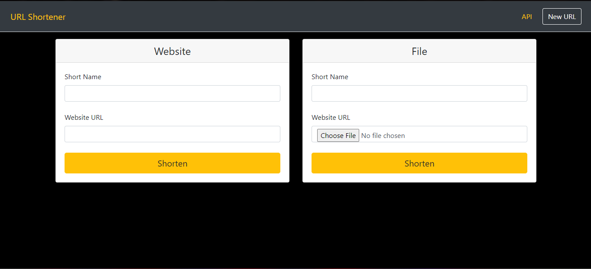
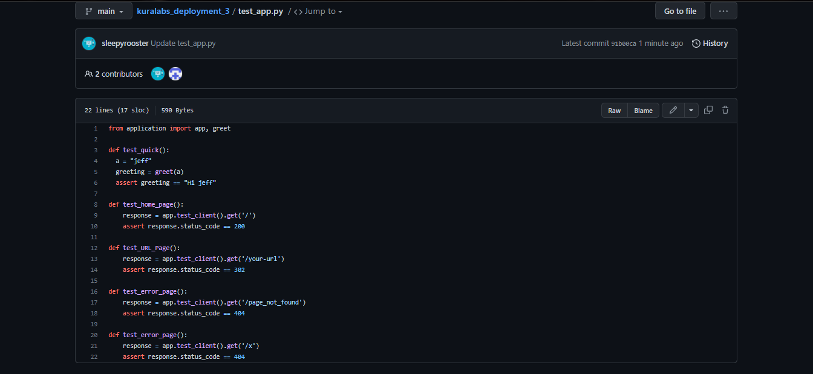

<h1>Deployment 4 Documentation</h1>

## Purpose of Deployment
The goal of this deployment is to:
- Use the Terraform CLI which is installed on the Jenkins server to create a VPC on AWS.

## Observation

## Changes to Pipline
#### Changing something on the apllication UI
By modifying the files in the `templates/home.html` `templates/your_page.html` `templates/base.html`, I was able to change the UI of the application.

Before:

After:

#### Adding More Tests
To test out some of the functionality of the application I created a few functions in the `test.py` to test the response code for each of the template pages and also to get a response code when inputing a URL that isn't in the application.

1) `test_home_page()` this function test to see when getting the `/home.html` URL, if it will get a 200 response code.
 
2) `test_URL_Page()` this function test to see when getting the `/your_url` URL, if it will get a 302 response code.

3) `test_error_page()` this function test to see when getting the `/x` or the `/page_not_found` URLs, if it will get a 404 response code.

#### A Way To Be Notified
To notify myself on any changes in the repository, i used the "watch" tab on the Github page.

## Errors While Performing Deployment
