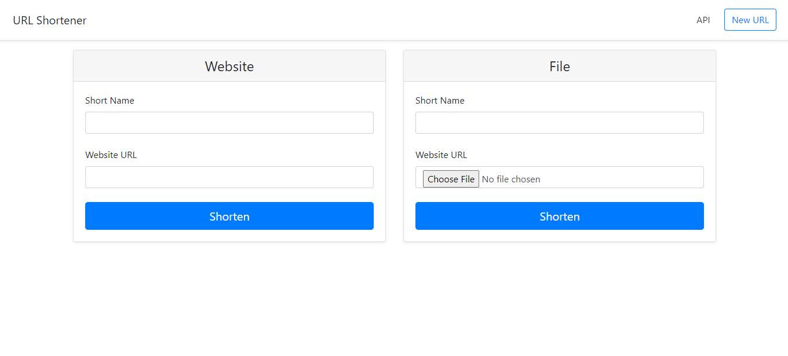
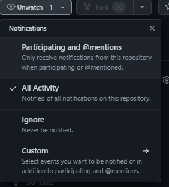

<h1>Deployment 4 Documentation</h1>

## Purpose of Deployment
The goal of this deployment is to:
- Use the Terraform CLI which is installed on the Jenkins server to create a VPC on AWS.

## Observation
To acomplish this deployment, I went though the following actions:
1) Spin up the Jenkins EC2 and install Terraform on this server.
2) Once logged into the Jenkins EC2, head to the Manage credentials tab and add your AWS Access Key and AWS Secret Key credentials.
3) Create a pipeline and connect the Github repository to this pipeline.
4) Once the deployment was sucessful, add a destroy stage so that the VPC which was created using the Terraform folder.
5) Run the deployment again and make sure the VPC was destroyed afterwards

## Changes to Pipline
#### Changing something on the apllication UI
By modifying the files in the `templates/home.html` `templates/your_page.html` `templates/base.html`, I was able to change the UI of the application.

Before:

After:

#### Adding More Tests
To test out some of the functionality of the application I created a few functions in the `test.py` to test the response code for each of the template pages and also to get a response code when inputing a URL that isn't in the application.

1) `test_home_page()` this function test to see when getting the `/home.html` URL, if it will get a 200 response code.
 
2) `test_URL_Page()` this function test to see when getting the `/your_url` URL, if it will get a 302 response code.

3) `test_error_page()` this function test to see when getting the `/x` or the `/page_not_found` URLs, if it will get a 404 response code.

#### A Way To Be Notified
To notify myself on any changes in the repository, i used the "watch" tab on the Github page.

## Errors While Performing Deployment
### Terrafrom Statelock Error
After trying the deployment without the destroy stage, i tired to destroy it in terminal and ran the pipeline again with the destroy stage added to the jenkins file. However, the pipeline failed due to an error. To fix this error i needed to go to the `/var/lib/jenkins/workspace` and delte the entire folder.

